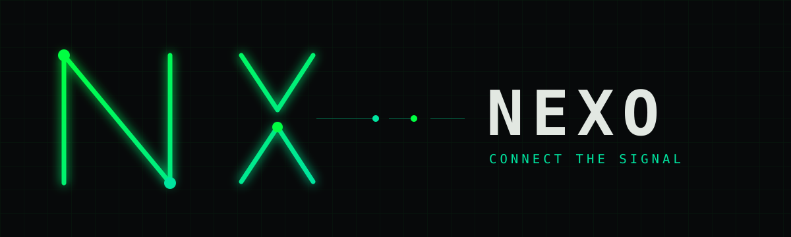

# Nexo



**An original Matrix-inspired theme for Obsidian.** Nexo gives your notes a calm, near-black canvas, a deliberate green hierarchy, and a graph that feels like a living network.

[Get Nexo](../../releases/latest) · [Graph palette](docs/GRAPH.md) · [Report an issue](../../issues)

[](https://buymeacoffee.com/nexoobsidian)

## What makes Nexo different

- **Signal, not noise.** Bright green marks navigation and important headings; neutral text keeps long notes comfortable to read.
- **A graph with depth.** Dark green links, luminous nodes, a subtle radial backdrop, and four distinct green tones for groups.
- **A consistent workspace.** Tabs, navigation, code, tags, tasks, callouts, and links share the same palette.
- **A support card you control.** The optional `buy` callout gives a note a clear support button without inserting ads into Obsidian.

Nexo is designed for Obsidian's dark appearance. The theme is written from scratch and has no build dependencies, bundled fonts, remote assets, or required community plugins.

## Graph palette

The theme styles Obsidian's built-in graph. Folder groups are saved by Obsidian in each vault, so use **Graph view → Settings → Groups** to assign your own queries:

| Group | Suggested color |
| --- | --- |
| Personal | Mint `#84f5b2` |
| Career | Signal `#00ff41` |
| Operations | Lime `#b8ff5a` |
| Meta | Aqua `#00e5a0` |

The [graph guide](docs/GRAPH.md) includes example queries. For a dedicated graph view with configurable groups and its own controls, see the separate [Nexo Graph plugin](https://github.com/tiagovilasboas/obsidian-nexo-graph).

If you install the optional Style Settings plugin, **Settings → Style Settings → Nexo Graph** lets you customize link, note, focus, tag, attachment, and unresolved-note colors, plus the native graph's background glow. Use that section's reset control to restore Nexo's defaults. Nexo works with its defaults when Style Settings is absent.

Maintainers can use the [safe demo vault and release checklist](docs/RELEASE_CHECKLIST.md) to check a release without private notes.

## Install

1. Download `manifest.json` and `theme.css` from the [latest release](../../releases/latest).
2. Place both files in `<your-vault>/.obsidian/themes/Nexo/`.
3. In Obsidian, choose **Settings → Appearance → Themes → Nexo**.
4. Set **Base color scheme → Dark**.

Installable theme releases are published on GitHub; the latest release includes the native graph controls described above. A Community Themes submission is planned.

## Add a support button to a note

The button above supports the project from GitHub. To add a clickable button inside Obsidian, copy this optional callout into a note. Nexo styles the link as a button; it appears only in notes where you add it.

```md
> [!buy] Support my work
> [Buy me a coffee](https://buymeacoffee.com/nexoobsidian)
```

The callout opens the same support page. Nexo does not insert it into your notes or workspace automatically.

## Make it yours

Edit [theme.css](theme.css) directly. Obsidian reloads the theme after you update the installed file. Colors and component styles are grouped by purpose in the stylesheet. Contributions and bug reports are welcome in [Issues](../../issues).

## Design and license

Nexo's visual system, palette, and CSS are original and made for Obsidian.

Nexo is available under the [MIT license](LICENSE).
